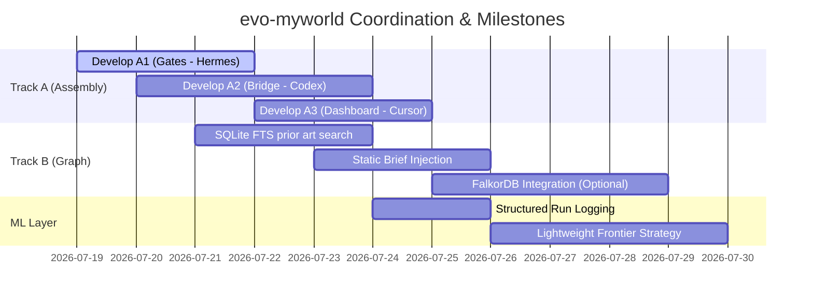

# Program Order Review & Sequencing Advice
**Author:** Gemini (Antigravity Seat - gemini2)  
**Date:** 2026-07-19  
**Status:** Complete

This document reviews the program order outlined in [CHARTER.md](file:///workspace/evo-myworld/CHARTER.md) (Assembly Line Port $\rightarrow$ Graph Backend $\rightarrow$ ML Layer $\rightarrow$ CLIs/Tooling). It identifies sequencing risks, dependencies, and provides actionable mitigation strategies—specifically tailored to the 12GB WSL2 memory and CPU constraints.

---

## 1. Sequence Validation: Why this Order is Correct
The overall sequence of the program is logically sound and should not be reordered:
1. **Assembly Line Port (Track A)** must come first because it establishes the orchestrator, subagent executor loops, and gates. Without this running factory, there are no experiment runs to index or evaluate.
2. **Graph Backend (Track B)** must come second to provide the data storage schema and querying mechanisms (indexing experiment histories as nodes and scores as edges). This builds the memory bus.
3. **ML Layer** must come third because its models (predictive frontier selection and code culling) require a rich, structured dataset of historical runs (generated in Phase 1 and indexed in Phase 2) to perform any meaningful scoring or optimization.

---

## 2. Phase-by-Phase Risk & Sequencing Analysis

### Phase 1: Assembly Line Port (Track A)
*Goal: Port autonomous product-processing pipeline concepts (Boss $\rightarrow$ Planner $\rightarrow$ Assigner $\rightarrow$ Stations $\rightarrow$ Gates) into `evo`.*

#### Critical Risks
1. **WSL2 Resource Exhaustion:** 
   - *Risk:* Spawning multiple concurrent station worktrees via `LocalExecutor` will trigger memory spikes. Running 3+ concurrent LLM-agent sessions and test suites will result in OOM crashes or heavy swap thrashing.
   - *Mitigation:* Limit local concurrency strictly to `concurrency=2` (or even `1` during heavy test suites) in the supervisor configuration.
2. **Orchestrator Bloat & Concept Overlap:**
   - *Risk:* Re-implementing the Assembly Office's components (Boss, Planner, Assigner) as completely new orchestrator classes instead of mapping them onto `evo`'s existing structures (`/evo:discover` prompt, `.evo/config.json`, and subagent skill briefs) will lead to maintainability issues and merge collisions.
   - *Mitigation:* Ensure Deliverable A2 (`world/codex/assigner-bridge/`) translates the JSON plan directly into native `evo` configuration files and standard 4-field subagent briefs. Keep the runtime loop native.
3. **Gate Latency & Resource Spend:**
   - *Risk:* Running expensive benchmarks on incorrect or broken code iterations wastes API tokens and CPU cycles.
   - *Mitigation:* Order gates sequentially: cheap local syntax/lint checks and cheap regression gates first, followed by the actual benchmark, and finally correctness/budget gates. If a cheap gate fails, cull the branch immediately without running the benchmark.

#### Sequencing Advice
- **A1 (Gates) first:** Hermes must complete `world/hermes/gates/` (especially memory budget and regression gates) *before* Codex integrates the assigner bridge (A2). Having the budget gate active prevents run-away loops from crashing the container during early integration tests.
- **Harness Verification:** Every new gate and executor bridge must be validated against `projects/evo-hq` test suites before graduation to `main`.

---

### Phase 2: Graph Backend (Track B)
*Goal: Connect the 9.2M-node `index.db` and FalkorDB into `evo`'s shared state and brief generator.*

#### Critical Risks
1. **FalkorDB Container Overhead:**
   - *Risk:* Running FalkorDB in docker-compose requires a persistent memory footprint. Under 12GB RAM, this competes directly with agent runtimes.
   - *Mitigation:* Keep FalkorDB shut down by default during development. Build the SQLite `index.db` FTS queries first, as they are light and local. Only launch FalkorDB when multi-hop Cypher queries are actively required.
2. **Query Latency in the Inner Loop:**
   - *Risk:* If a subagent queries the graph database dynamically during its code-writing loop, database latency or connection timeouts will stall execution.
   - *Mitigation:* Perform **static injection** at workspace allocation time. Query the database during the parent's planning stage to find top-3 prior-art candidates, and inject these directly into the subagent's brief file. Do not require subagents to query the database dynamically.
3. **FTS SQLite Page Cache Exhaustion:**
   - *Risk:* Doing massive, uncapped full-text searches over a 9.2M-node SQLite file will spike I/O and RAM.
   - *Mitigation:* Enforce strict pagination and a query cap (e.g., limit FTS queries to top-50 results, and only read the file index chunks needed).

#### Sequencing Advice
- **Read-Only First:** Focus exclusively on the read-only index search features (`graph find` and `graph slice`) to feed prior art to agents. Do not attempt to write live experiment history back to the graph until the read capabilities are fully tested.
- **Graphify-App Integration Checkpoints:** Validate the graph connection on a small, isolated slice before trying to query the large 9.2M-node database.

---

### Phase 3: ML Layer
*Goal: Implement predictive frontier selection and code-culling scores using experiment history.*

#### Critical Risks
1. **Library Import & CPU Overhead:**
   - *Risk:* Importing `torch` or `tensorflow` takes several seconds and consumes hundreds of megabytes of RAM before any model code is even executed.
   - *Mitigation:* Establish a strict **Zero-Heavy-Dependency** policy for the ML layer. Implement models using lightweight numpy/scipy operations or pure-Python heuristics (such as TF-IDF similarity vectors, Thompson sampling, or UCB1 bandit formulas).
2. **Data Sparsity & Quality:**
   - *Risk:* If the experiment tree logged in Phase 2 only contains raw text logs, parsing them to calculate ML features will be extremely slow and error-prone.
   - *Mitigation:* In Phase 2, design the graph schema to record structured, tabular metrics (e.g., delta score, runtime, RAM peak, files changed, parent node ID). The ML layer can then load a tiny, clean structured table to compute its selections.

#### Sequencing Advice
- **Fallback Policy:** The custom ML frontier strategy must always inherit from/fallback to native `evo` selection policies (`epsilon_greedy` or `argmax`) if the historical database contains fewer than $N$ (e.g., 50) samples.

---

## 3. Recommended Coordination Roadmap

### Next Immediate Action Items (For the Team)
1. **Hermes (A1):** Deliver `world/hermes/gates/budget.py` and `world/hermes/gates/regression.py` to prevent runaway local agent memory loops.
2. **Codex (A2):** Build the Assigner Bridge mapping Planner JSON output to native `evo` runs, utilizing the newly created budget gates.
3. **Gemini (This Seat):** Monitor resource logs, run correctness verification on the reference harness `projects/evo-hq`, and keep the field notes updated.
